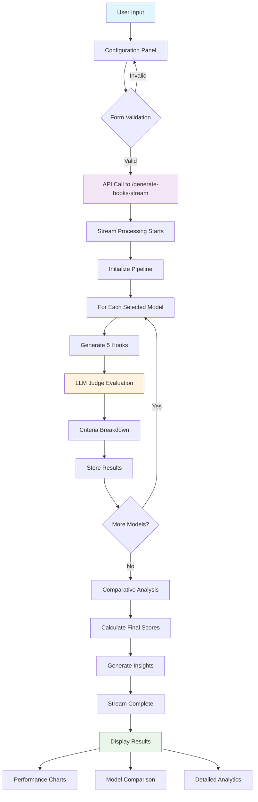

# LinkedIn Hook LLM Evaluator

A sophisticated Next.js application that generates and evaluates LinkedIn post hooks using multiple AI models with LLM-as-a-Judge evaluation methodology.

## 🚀 Features

- **Multi-Model Hook Generation**: Generate hooks using GPT-4o, Claude 3.5 Sonnet, and other leading AI models
- **Advanced LLM Evaluation**: Uses GPT-4o as a judge to evaluate hook quality with detailed criteria breakdown
- **Focus Skills System**: Target specific hook characteristics (Charisma, Empathy, Authority, etc.)
- **Real-time Progress Tracking**: Stream processing with detailed progress indicators
- **Comparative Analysis**: Head-to-head comparison between different AI models
- **Atomic Design Architecture**: Clean, maintainable component structure
- **Performance Analytics**: Detailed metrics and insights for generated hooks

## 🏗️ Architecture

The application follows atomic design principles with a clear separation of concerns:

```
src/
├── app/                    # Next.js App Router
│   ├── api/               # API routes
│   │   ├── generate-hooks-stream/  # Main hook generation endpoint
│   │   └── save-analysis/          # Analysis export endpoint
│   └── page.tsx           # Main application page
├── components/            # UI Components (Atomic Design)
│   ├── atoms/            # Basic UI elements (Button, Input, Card, etc.)
│   ├── molecules/        # Compound components (ModelSelector, HookSkillsSelector, etc.)
│   └── organisms/        # Complex sections (Header, ConfigurationPanel, etc.)
├── hooks/                # Custom React hooks
│   ├── useHookGeneration.ts  # Main state management
│   ├── useUIState.ts         # UI state management
│   └── useScrollUtils.ts     # Scroll utilities
├── lib/                  # Core business logic
│   ├── unified-llm-service.ts    # AI model integration
│   ├── evaluation-service.ts     # Basic hook evaluation
│   ├── llm-judge.ts             # Advanced LLM-as-a-Judge evaluation
│   └── pipeline-orchestrator.ts # Orchestration logic
└── types/                # TypeScript type definitions
```

## 🔄 Hook Generation Flow



## 🧠 LLM-as-a-Judge Evaluation

The system uses an advanced evaluation methodology where GPT-4o acts as a judge to evaluate hooks based on multiple criteria:

### Evaluation Criteria
- **Attention Grabbing**: Ability to stop scrolling and capture interest
- **Emotional Impact**: Evokes curiosity, surprise, urgency, or empathy
- **Clarity & Brevity**: Clear, concise messaging (6-12 words optimal)
- **Relevance to Audience**: Professional LinkedIn audience alignment
- **Social Proof**: Authority signals and credibility markers
- **Actionability Promise**: Implies valuable, actionable content

### Judge Confidence System
- Each evaluation includes a confidence score (1-10)
- Multiple validation layers ensure consistent scoring
- Fallback to basic evaluation if judge fails

## 🎯 Focus Skills System

Users can select up to 3 focus skills to emphasize in hook generation:

| Skill | Icon | Description |
|-------|------|-------------|
| **Charisma** | ⚡ | Captures attention and creates curiosity |
| **Empathy** | 💝 | Connects emotionally with the audience |
| **Authority** | 👑 | Establishes credibility and expertise |
| **Wisdom** | 🧠 | Shares valuable insights and knowledge |
| **Insight** | 💡 | Provides unique perspectives and revelations |
| **Power** | ⚔️ | Commands attention with strong statements |

Selected skills modify the AI prompt to emphasize these characteristics in generated hooks.

## 🤖 Supported AI Models

### OpenAI Models
- **GPT-4o**: Most advanced with superior creativity
- **GPT-4o Mini**: Fast and cost-efficient
- **O4 Mini**: Reasoning-focused mini model
- **GPT-4.1**: Flagship model for complex tasks

### Anthropic Models
- **Claude 3.5 Sonnet**: Flagship with excellent reasoning
- **Claude 3.5 Haiku**: Lightning-fast processing

## 📊 Analytics & Insights

The system provides comprehensive analytics:

- **Model Performance Rankings**: Head-to-head comparisons
- **Score Distributions**: Detailed scoring breakdowns
- **Execution Metrics**: Processing time and token usage
- **Judge Confidence**: Evaluation reliability metrics
- **Comparative Analysis**: Winner determination with reasoning

## 🛠️ Getting Started

### Prerequisites
- Node.js 18+ 
- OpenAI API key
- Anthropic API key

### Installation

1. Clone the repository:
```bash
git clone <repository-url>
cd linkedin-hook-llm-eval
```

2. Install dependencies:
```bash
npm install
```

3. Set up environment variables:
```bash
cp .env.example .env.local
```

Add your API keys:
```env
OPENAI_API_KEY=your_openai_api_key
ANTHROPIC_API_KEY=your_anthropic_api_key
```

4. Run the development server:
```bash
npm run dev
```

Open [http://localhost:3000](http://localhost:3000) in your browser.

## 🎨 UI/UX Features

- **Dynamic Layout**: Configuration panel moves from center to sidebar when processing
- **Real-time Progress**: Live updates during hook generation and evaluation
- **Smooth Animations**: 700ms transitions for layout changes
- **Responsive Design**: Works on desktop and mobile devices
- **Dark Theme**: Professional dark mode interface
- **Table of Contents**: Easy navigation through results sections

## 📡 API Endpoints

### POST /api/generate-hooks-stream
Generates hooks using selected AI models with streaming response.

**Request Body:**
```json
{
  "postIdea": "string",
  "industry": "string (optional)",
  "targetAudience": "beginner|intermediate|expert",
  "contentType": "tip|story|announcement|question",
  "selectedModels": ["gpt4o", "claude-3-5-sonnet"],
  "focusSkills": ["attention_grabbing", "emotional_impact"],
  "analysisOptions": ["semantic", "psychological", "engagement"]
}
```

**Response:** Server-Sent Events stream with progress updates and final results.

### POST /api/save-analysis
Exports analysis results to JSON file.

## 🧪 Testing

```bash
# Run linting
npm run lint

# Build for production
npm run build

# Start production server
npm start
```

## Contributing

1. Fork the repository
2. Create a feature branch
3. Make your changes
4. Run `npm run lint` and `npm run build` 
5. Submit a pull request

## License

MIT License - see LICENSE file for details
